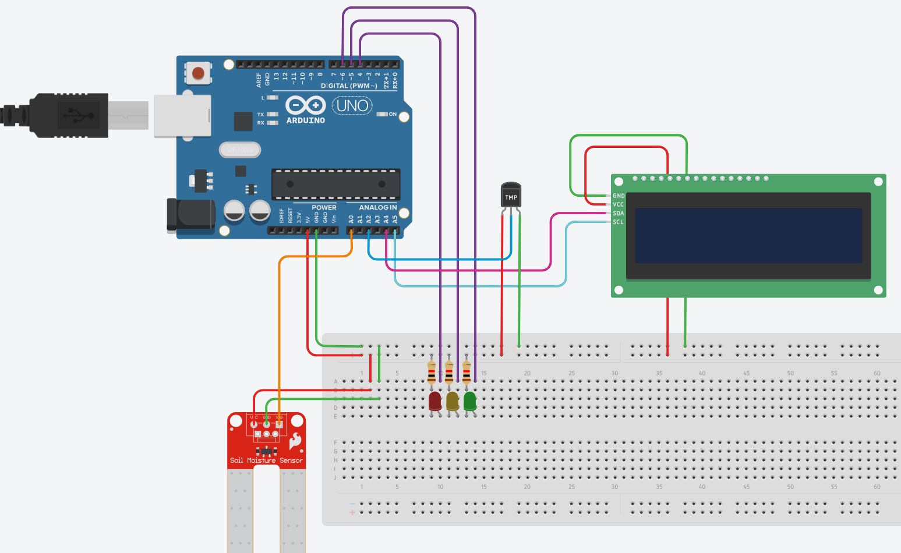
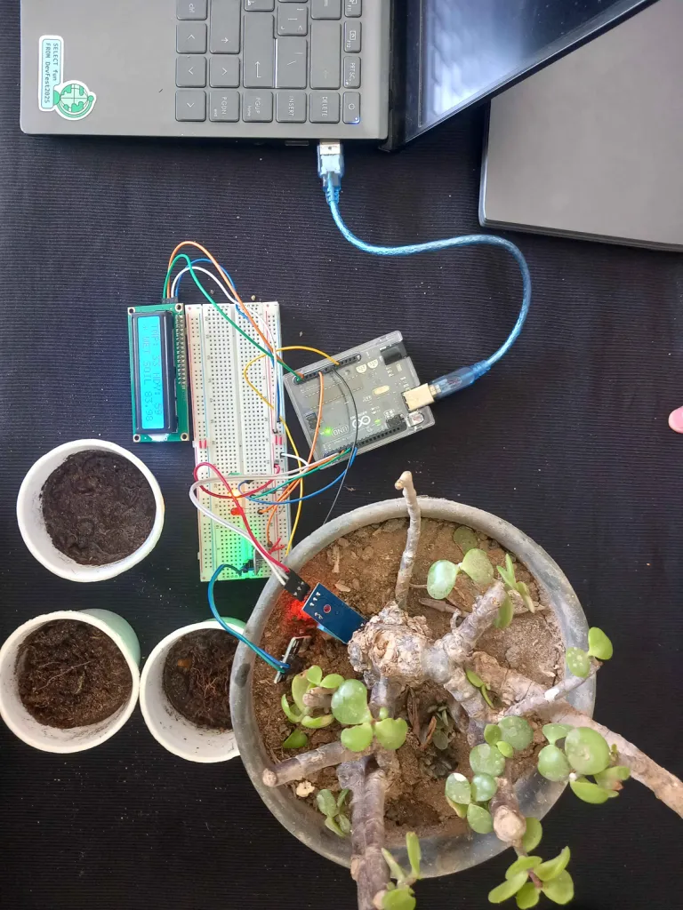

# Filaha - IoT Project in AgreTech
IoT Project for helping farmer in detecting any illnesses in the crops and over watering. This repository for the very basic prototype of this project. This prototype shows the basic pipeline of the project.

The project was developed and presented at the 'Beheira Innovates' competition, organized by the Beheira Governorate in collaboration with Damanhour University.

## Team Members
- **Mohammed Saleh** - *Mathematic and Computer Science*: Team leader, Embedded and Backend Developer
- **Marwan Elkenawy** - *Computer Science*: Researcher and Presenting the project
- **Omar Elmuslimany** - *Computer and Information Technology*: helped in Embedded, Presentation and Future Vision Website
- **Abdelrahman Rashed** - *Computer and Information Technology*: Client Prototype
## Project Parts
- Device: Arduino UNO
- Backend: Flask
- AI: Gemma API
- Client: ReactJS

## Device
### Components
- [Arduino UNO](https://docs.arduino.cc/hardware/uno-rev3/)
- [Soil Sensor](https://makerselectronics.com/product/soil-moisture-sensor/)
- [DHT11 Sensor](https://makerselectronics.com/product/dht11-board/) (temperature and humidity sensor)
- [LCD_I2C 16x2](https://www.amazon.eg/-/en/LCD1602-Display-Module-Blue-Backlight/dp/B0FD24RG6V)
- 3 color LEDs (Red, Yellow, Green) and 3 Resistance 220 Ohm
- Bread Board
### Circuit Design



### How does it work?
Arduino reads all sensors data using its libraries in Arduino IDE then output it on the LCD screen and in the serial port `/dev/ttyAMC0` or whatever, outputs data in this way 

`temperature, humidity, Moisture, Moisture analog value`

For example:
`32, 61, moist, 550`

And output the same on the screen but instead of the analog value from the soil sensor it being converted into percentage.

All used code is located at `arduino/arduino.ino` for Arduino IDE. 

## Backend
We used Flask API for fast prototyping and to make it easy in communication with the Serial port `/dev/ttyAMC0`

### Dependencies and Functions
#### PySerial
Allow to access the serial port in a parallel thread to update a global variable for Backend.
#### google-genai
For Google AI API interface. For AI Overview and Chat Bot.
#### flask, flask-cors
a small Backend framework for API Endpoints
### How to run?
- setup environment: https://flask.palletsprojects.com/en/stable/installation/#virtual-environments
- Install dependencies
```sh
pip install -r ./requirements.txt
```
- Add Google AI API Key
```sh
export GEMINI_API_KEY="YOU API TOKEN GOES HERE"
```
- RUN!
```sh
flask --app main run --debug
```
This code will connect to the Arduino on `/dev/ttyAMC0` port, connect to Google AI API, so you would need to connect your Arduino, internet and Google API token. if there is some different constants about your Arduino, you can edit `embd.py`

### API Endpoints
- GET /sensor
```json
{
    "hmd" : "61",
    "tmp" : "28",
    "wet" : "DRY"
}
```

- POST /ai

body: 
```json
{
    "msg" : "AI INPUT HERE!"
}
```
respond
```json
{
    "res" : "AI Respond!"
}
```

## Client
the Client collects all sensor data and combine it with the plant name and current weather data from OpenWeather using current location to provide the user with all data after Analysis by AI Overview.